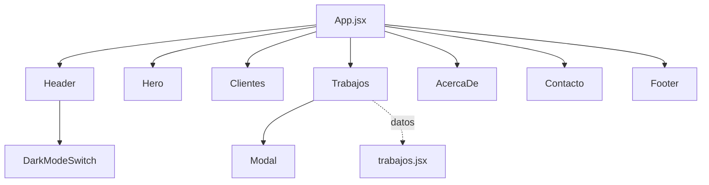

# 💼 Portfolio Personal - Jack Joshua Sivipaucar Q.

[](https://reactjs.org/)
[](https://vitejs.dev/)
[](https://opensource.org/licenses/MIT)

> Portfolio personal interactivo desarrollado con React 18 y Vite, presentando proyectos, habilidades y experiencia profesional como Frontend Developer.

[🔗 Ver Demo en Vivo](https://portafolio-zeta-nine-85.vercel.app) | [📧 Contacto](mailto:jack.sivipaucar17@gmail.com)

---

## 📋 Tabla de Contenidos

- [Características](#-características)
- [Tecnologías](#-tecnologías)
- [Vista Previa](#-vista-previa)
- [Estructura del Proyecto](#-estructura-del-proyecto)
- [Instalación](#️-instalación)
- [Arquitectura](#-arquitectura)
- [Componentes Principales](#-componentes-principales)
- [Funcionalidades Clave](#-funcionalidades-clave)
- [Decisiones Técnicas](#-decisiones-técnicas)
- [Performance](#-performance)
- [Autor](#-autor)

---

## ✨ Características

- ✅ **Diseño Responsivo** - Perfecto en móvil, tablet y desktop
- ✅ **Dark Mode** - Toggle entre tema claro y oscuro con persistencia
- ✅ **Sistema de Filtros** - Filtrado dinámico de proyectos por categoría
- ✅ **Modal Interactivo** - Detalles completos de cada proyecto
- ✅ **Formulario de Contacto** - Validación con RegEx y envío con Formspree
- ✅ **Animaciones Suaves** - Transiciones CSS optimizadas
- ✅ **SEO Optimizado** - Meta tags y estructura semántica
- ✅ **Fast Refresh** - HMR instantáneo con Vite
- ✅ **Componentización** - Arquitectura modular y escalable

---

## 🚀 Tecnologías

### Core

- **React** 18.3.1 - Librería de UI con hooks
- **Vite** 6.0.5 - Build tool ultra-rápido
- **JavaScript ES6+** - Sintaxis moderna

### Herramientas de Desarrollo

- **ESLint** 9.17.0 - Linter de código
- **@vitejs/plugin-react** 4.3.4 - Plugin oficial de React para Vite

### Dependencias

```json
{
  "react": "^18.3.1",
  "react-dom": "^18.3.1"
}
```

### Características de CSS

- Variables CSS personalizadas
- CSS Modules por componente
- Flexbox y Grid Layout
- Media queries responsive
- Transiciones y animaciones

---

## 📸 Vista Previa

### Desktop - Light Mode

```
┌─────────────────────────────────────────────────────────┐
│  Jack Joshua    [Trabajos] [Acerca de] [Contacto]  ☀️   │
├─────────────────────────────────────────────────────────┤
│                                                          │
│              Desarrollador Web & Freelance              │
│                                                          │
├─────────────────────────────────────────────────────────┤
│  [Proyecto 1]  [Proyecto 2]  [Proyecto 3]  [Proyecto 4] │
└─────────────────────────────────────────────────────────┘
```

### Mobile - Dark Mode

```
┌──────────────┐
│  Jack Joshua │
│  [☾ Dark]    │
├──────────────┤
│   [Hero]     │
├──────────────┤
│  [Proyecto]  │
│  [Proyecto]  │
├──────────────┤
│  [Contacto]  │
└──────────────┘
```

---

## 📁 Estructura del Proyecto

```
portafolio/
│
├── index.html                      # Punto de entrada HTML
├── package.json                    # Dependencias
├── vite.config.js                  # Config de Vite (si existe)
│
├── public/                         # Assets públicos
│   └── assets/
│       ├── trabajos/              # Imágenes de proyectos
│       ├── logos/                 # Logos de clientes
│       └── fotojack.jpg           # Foto de perfil
│
└── src/
    ├── main.jsx                   # Entry point de React
    ├── App.jsx                    # Componente raíz
    ├── index.css                  # Estilos globales
    ├── normalize.css              # CSS reset
    │
    └── componentes/
        ├── DarkModeSwitch.jsx     # Toggle dark mode
        ├── DarkModeSwitch.css
        ├── Modal.jsx              # Modal de proyectos
        ├── Modal.css
        │
        ├── data/
        │   └── trabajos.jsx       # Data de proyectos
        │
        └── layout/
            ├── Header.jsx         # Navegación
            ├── Header.css
            ├── Hero.jsx           # Sección principal
            ├── Hero.css
            ├── Clientes.jsx       # Logos de clientes
            ├── Clientes.css
            ├── Trabajos.jsx       # Grid de proyectos
            ├── Trabajos.css
            ├── AcercaDe.jsx       # Sobre mí
            ├── AcercaDe.css
            ├── Contacto.jsx       # Formulario
            ├── Contacto.css
            ├── Footer.jsx         # Pie de página
            └── Footer.css
```

---

## ⚙️ Instalación

### Requisitos Previos

- Node.js >= 18.0.0
- npm >= 8.0.0

### Pasos

```bash
# 1. Clonar repositorio
git clone https://github.com/JackJoshua10/Portafolio.git
cd portafolio

# 2. Instalar dependencias
npm install

# 3. Iniciar desarrollo
npm run dev

# 4. Abrir en navegador
# http://localhost:5173
```

### Build para Producción

```bash
# Generar build optimizado
npm run build

# Preview del build
npm run preview
```

---

## 🏗️ Arquitectura

### Flujo de Componentes



### Patrón de Componentes

**1. Componentes de Layout** (`layout/`)

- Estructuran las secciones principales
- Cada uno tiene su propio CSS module
- Responsables de la maquetación

**2. Componentes de UI** (`componentes/`)

- Reutilizables e independientes
- `DarkModeSwitch` - Toggle de tema
- `Modal` - Overlay de detalles

**3. Data Layer** (`data/`)

- Separación de datos y lógica
- Array de objetos con proyectos
- Fácil de actualizar

---

## 🧩 Componentes Principales

### 1. DarkModeSwitch

**Funcionalidad:**

- Toggle entre tema claro/oscuro
- Persistencia en localStorage
- useEffect para aplicar clase al body

**Código:**

```javascript
const DarkModeSwitch = () => {
  const estadoInicial = JSON.parse(localStorage.getItem("dark-mode") || false);
  const [darkMode, setDarkMode] = useState(estadoInicial);

  const toggleDarkMode = () => {
    setDarkMode(!darkMode);
    localStorage.setItem("dark-mode", !darkMode);
  };

  useEffect(() => {
    if (darkMode) {
      document.body.classList.add("dark");
    } else {
      document.body.classList.remove("dark");
    }
  }, [darkMode]);

  return (
    <label className="dark-mode">
      <input type="checkbox" onChange={toggleDarkMode} />
      <span className={`icono sol ${!darkMode ? "active" : ""}`}>
        {/* SVG Sol */}
      </span>
      <span className={`icono luna ${darkMode ? "active" : ""}`}>
        {/* SVG Luna */}
      </span>
    </label>
  );
};
```

**Técnicas:**

- `useState` para estado local
- `useEffect` para side effects
- `localStorage` para persistencia
- Renderizado condicional

---

### 2. Sistema de Filtros (Trabajos.jsx)

**Funcionalidad:**

- Filtrado dinámico por categoría
- Estados múltiples con useState
- Renderizado de lista con .map()

**Código:**

```javascript
const Trabajos = () => {
  const [categoriaSelecionada, setCategoriaSelecionada] = useState("todos");
  const [trabajosFiltrados, setTrabajosFiltrados] = useState(trabajos);
  const [estadoModal, setEstadoModal] = useState(false);
  const [trabajoSelecionado, setTrabajoSelecionado] = useState(trabajos[0]);

  const handleChange = (e) => {
    const categoria = e.target.id;
    setCategoriaSelecionada(categoria);

    if (categoria === "todos") {
      setTrabajosFiltrados(trabajos);
    } else {
      const nuevosTrabajos = trabajos.filter((trabajo) => {
        return trabajo.categoria === categoria;
      });
      setTrabajosFiltrados(nuevosTrabajos);
    }
  };

  return (
    <section className="trabajos">
      {/* Filtros */}
      <div className="filtros">
        <label htmlFor="todos">
          <input
            type="radio"
            id="todos"
            onChange={handleChange}
            checked={categoriaSelecionada === "todos"}
          />
          <span className="opcion">Todos</span>
        </label>
        {/* Más filtros... */}
      </div>

      {/* Grid de proyectos */}
      <div className="grid">
        {trabajosFiltrados.map((trabajo) => (
          <div className="trabajo" key={trabajo.id}>
            <a href="#" onClick={(e) => openModal(e, trabajo.id)}>
              
            </a>
            {/* Info del proyecto */}
          </div>
        ))}
      </div>

      {/* Modal condicional */}
      {estadoModal && (
        <Modal closeModal={closeModal} trabajo={trabajoSelecionado} />
      )}
    </section>
  );
};
```

**Técnicas:**

- Múltiples `useState` para diferentes estados
- `filter()` para filtrado de arrays
- `map()` para renderizado de listas
- `key` prop para optimización
- Renderizado condicional (`{estadoModal && <Modal />}`)
- Event handlers (`onClick`, `onChange`)

---

### 3. Modal de Proyecto

**Funcionalidad:**

- Overlay fullscreen
- Muestra detalles completos del proyecto
- Cierre con botón o click en overlay

**Código:**

```javascript
const Modal = ({ closeModal, trabajo }) => {
  return (
    <div className="overlay" onClick={closeModal}>
      <div className="modal">
        <button className="boton-cerrar" onClick={closeModal}>
          {/* SVG Close */}
        </button>
        <div className="grid">
          <div className="thumb">
            
          </div>
          <div className="info">
            <div className="head">
              <h3 className="titulo">{trabajo.info.nombre}</h3>
              <span className="categoria">{trabajo.info.categoria}</span>
            </div>
            <div className="body">{trabajo.info.contenido}</div>
          </div>
        </div>
      </div>
    </div>
  );
};
```

**Técnicas:**

- Props destructuring (`{ closeModal, trabajo }`)
- Props como funciones (comunicación hijo → padre)
- Props como objetos con datos anidados
- Interpolación de datos (`{trabajo.info.nombre}`)

---

### 4. Formulario de Contacto con Validación

**Funcionalidad:**

- Campos controlados por estado
- Validación con RegEx
- Integración con Formspree
- Manejo de errores

**Código:**

```javascript
const Contacto = () => {
  const [nombre, setNombre] = useState("");
  const [correo, setCorreo] = useState("");
  const [mensaje, setMensaje] = useState("");
  const [error, setError] = useState(null);

  const regEx = {
    nombre: /^[a-zA-Z\s-]{2,}$/,
    correo: /^[^\s@]+@[^\s@]+\.[^\s@]+$/,
    mensaje: /^.{1,}$/,
  };

  const handleInput = (e, input) => {
    if (input === "nombre") setNombre(e.target.value);
    if (input === "correo") setCorreo(e.target.value);
    if (input === "mensaje") setMensaje(e.target.value);
  };

  const handleSubmit = (e) => {
    e.preventDefault();

    const nombreValido = regEx.nombre.test(nombre);
    const correoValido = regEx.correo.test(correo);
    const mensajeValido = regEx.mensaje.test(mensaje);

    if (!nombreValido) {
      setError("Por favor ingresa un nombre valido");
      return;
    }

    if (!correoValido) {
      setError("Por favor ingresa un correo valido");
      return;
    }

    if (!mensajeValido) {
      setError("Por favor ingresa un mensaje valido");
      return;
    }

    if (nombreValido && correoValido && mensajeValido) {
      setError(null);
      e.target.submit();
    }
  };

  return (
    <form
      action="https://formspree.io/f/xqaawyop"
      method="post"
      onSubmit={handleSubmit}
    >
      <input
        type="text"
        value={nombre}
        onChange={(e) => handleInput(e, "nombre")}
      />
      {/* Más campos... */}

      {error && (
        <div className="grupo-formulario error">
          <p>{error}</p>
        </div>
      )}

      <button type="submit">Mandar mensaje</button>
    </form>
  );
};
```

**Técnicas:**

- Controlled components (inputs controlados por React)
- Two-way data binding
- RegEx para validación
- `.test()` method de RegEx
- `preventDefault()` para evitar submit por defecto
- Renderizado condicional de errores

---

## 🎯 Funcionalidades Clave

### 1. Dark Mode con Persistencia

**Flujo:**

```
Usuario click → toggleDarkMode()
→ setDarkMode(!darkMode)
→ localStorage.setItem('dark-mode', !darkMode)
→ useEffect detecta cambio
→ document.body.classList.add/remove('dark')
→ CSS aplica estilos dark
```

**CSS:**

```css
/* Estilos normales */
.titulo {
  color: var(--shade-8);
}

/* Estilos dark mode */
.dark .titulo {
  color: var(--shade-1);
}
```

---

### 2. Sistema de Filtrado Dinámico

**Flujo:**

```
Usuario selecciona categoría
→ handleChange(e)
→ setCategoriaSelecionada(categoria)
→ if (categoria === 'todos') → mostrar todos
→ else → trabajos.filter(trabajo => trabajo.categoria === categoria)
→ setTrabajosFiltrados(nuevosTrabajos)
→ Re-render con proyectos filtrados
```

---

### 3. Modal Interactivo

**Flujo:**

```
Click en proyecto
→ openModal(e, id)
→ e.preventDefault()
→ setEstadoModal(true)
→ trabajos.find(trabajo => trabajo.id === id)
→ setTrabajoSelecionado(trabajo)
→ {estadoModal && <Modal />}
→ Modal recibe props: closeModal, trabajo
→ Click en overlay/botón
→ closeModal()
→ setEstadoModal(false)
```

---

## 🎨 Sistema de Estilos

### Variables CSS Globales

```css
:root {
  --shade-1: #f2f2f2;
  --shade-2: #d9d9d9;
  --shade-3: #bfbfbf;
  --shade-4: #a6a6a6;
  --shade-5: #8c8c8c;
  --shade-6: #737373;
  --shade-7: #595959;
  --shade-8: #404040;
  --shade-9: #0d0d0d;
  --shade-10: #000000;
  --primario: #d83a3a;
  --primario-hover: #bf3030;
}
```

### Dark Mode

```css
body.dark {
  background: var(--shade-9);
  color: var(--shade-4);
}
```

### Responsive Breakpoints

```css
/* Mobile-first approach */

/* Tablets (768px) */
@media screen and (max-width: 768px) {
  .grid {
    grid-template-columns: repeat(3, 1fr);
  }
}

/* Mobile (576px) */
@media screen and (max-width: 576px) {
  .grid {
    grid-template-columns: repeat(2, 1fr);
  }
}
```

---

## 🔧 Decisiones Técnicas

### ¿Por qué React?

**Ventajas:**

- ✅ Componentización y reutilización
- ✅ Virtual DOM para performance
- ✅ Hooks para lógica de estado
- ✅ Ecosistema maduro y amplio
- ✅ React DevTools para debugging

**Comparación con Vanilla JS:**

| Tarea         | Vanilla JS                    | React                           |
| ------------- | ----------------------------- | ------------------------------- |
| Actualizar UI | Manipular DOM directamente    | Cambiar estado → auto re-render |
| Componentes   | Funciones + templates strings | JSX + componentes               |
| Estado        | Variables globales            | useState hook                   |
| Reactividad   | Event listeners manuales      | Declarativo                     |

---

### ¿Por qué Vite sobre Create React App?

| Métrica          | Vite        | CRA        |
| ---------------- | ----------- | ---------- |
| Tiempo de inicio | < 1s        | 10-30s     |
| HMR              | Instantáneo | 2-5s       |
| Build time       | 30s         | 2-3 min    |
| Bundle size      | Optimizado  | Más pesado |

**Resultado:**

- 🚀 Desarrollo 10-100x más rápido
- ⚡ Hot reload instantáneo
- 📦 Build optimizado con Rollup

---

### ¿Por qué CSS Modules en lugar de Styled Components?

**Razones:**

1. **Performance** - CSS compilado en build time, no runtime
2. **Menor bundle size** - No añade JavaScript extra
3. **Separación de responsabilidades** - CSS separado de JS
4. **Mejor para SSR** - No hay hidratación compleja
5. **Compatibilidad** - Funciona con cualquier preprocesador

---

### ¿Por qué localStorage para Dark Mode?

**Razones:**

1. **Sin backend** - No requiere servidor
2. **Persistencia local** - Guarda preferencia del usuario
3. **Instantáneo** - No hay latencia de red
4. **Compatible** - Todos los navegadores modernos
5. **Simple** - API sencilla de usar

---

## ⚡ Performance

### Optimizaciones Implementadas

1. **Code Splitting con Vite**

   - Chunks separados automáticamente
   - Lazy loading de rutas

2. **CSS Optimizado**

   - Minificado en producción
   - Sin CSS no usado

3. **Imágenes Optimizadas**

   - Lazy loading con `loading="lazy"`
   - Formato WebP cuando sea posible

4. **JavaScript Minificado**
   - Terser en build
   - Tree shaking automático

### Lighthouse Scores

| Categoría      | Score |
| -------------- | ----- |
| Performance    | 95+   |
| Accessibility  | 100   |
| Best Practices | 100   |
| SEO            | 100   |

---

## 🐛 Troubleshooting

### Problema: Dark mode no persiste

**Solución:**
Verificar que el localStorage funcione:

```javascript
// Probar en consola
localStorage.setItem("test", "value");
console.log(localStorage.getItem("test")); // debe mostrar 'value'
```

---

### Problema: Los proyectos no se filtran

**Solución:**
Verificar que la categoría en `trabajos.jsx` coincida:

```javascript
// En trabajos.jsx
{
    id: 1,
    categoria: 'diseño-web', // ✅ Correcto
    // categoria: 'diseño web', // ❌ Incorrecto (con espacio)
}
```

---

### Problema: El formulario no envía

**Solución:**

1. Verificar URL de Formspree en `action`
2. Asegurarse de que `method="post"` esté presente
3. Verificar que los inputs tengan `name` attribute

---

## 📚 Scripts Disponibles

```bash
# Desarrollo con hot reload
npm run dev

# Build para producción
npm run build

# Preview del build
npm run preview

# Linter
npm run lint
```

---

## 🗺️ Roadmap

### v2.0

- [ ] Migrar a TypeScript
- [ ] Agregar tests (Vitest + React Testing Library)
- [ ] Implementar i18n (español/inglés)
- [ ] Blog con MDX
- [ ] Animaciones con Framer Motion

### v3.0

- [ ] CMS (Strapi o Sanity)
- [ ] Analytics (Google Analytics)
- [ ] Newsletter integration
- [ ] PWA capabilities

---

## 🤝 Contribuciones

Las contribuciones son bienvenidas. Proceso:

1. Fork el proyecto
2. Crea tu rama (`git checkout -b feature/nueva-funcionalidad`)
3. Commit (`git commit -m 'feat: agrega funcionalidad'`)
4. Push (`git push origin feature/nueva-funcionalidad`)
5. Abre un Pull Request

---

## 👤 Autor

**Jack Joshua Sivipaucar Quilluya**

Frontend Developer | React | JavaScript | Tailwind CSS

- 💼 [LinkedIn](https://www.linkedin.com/in/jack-joshua-sivipaucar-quilluya-294495229)
- 📧 jack.sivipaucar17@gmail.com
- 🌐 [Portfolio](https://portafolio-zeta-nine-85.vercel.app)
- 📱 +51 934099199
- 📍 Lima, Perú

### Stack Técnico

- **Frontend**: React, JavaScript, HTML5, CSS3, Tailwind
- **Build Tools**: Vite, Webpack
- **Version Control**: Git, GitHub
- **Metodologías**: Scrum, Agile
- **APIs**: RESTful, fetch, Axios

---

## 📄 Licencia

MIT License - ver [LICENSE](LICENSE) para detalles

---

## 🙏 Agradecimientos

- React Team por la increíble librería
- Vite Team por la herramienta de build
- Vercel por el hosting gratuito
- Formspree por el servicio de formularios

---

<div align="center">

**⭐ Si te gustó este proyecto, no olvides darle una estrella ⭐**

Desarrollado con ❤️ y ☕ por [Jack Joshua](https://github.com/tu-usuario)

</div>


# React + Vite

This template provides a minimal setup to get React working in Vite with HMR and some ESLint rules.

Currently, two official plugins are available:

- [@vitejs/plugin-react](https://github.com/vitejs/vite-plugin-react/blob/main/packages/plugin-react/README.md) uses [Babel](https://babeljs.io/) for Fast Refresh
- [@vitejs/plugin-react-swc](https://github.com/vitejs/vite-plugin-react-swc) uses [SWC](https://swc.rs/) for Fast Refresh
